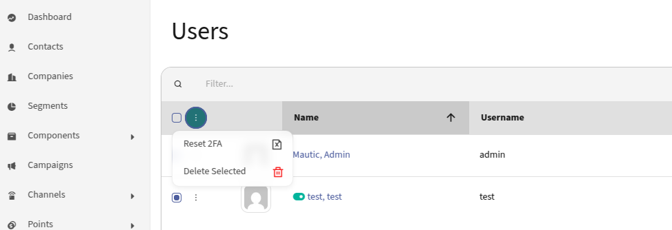

# Mautic 2FA Bundle by Lenon Leite

CONTENTS OF THIS FILE
---------------------

* Introduction
* Requirements
* Installation
* Usage
* Author
* Credits

INTRODUCTION
------------
The Mautic 2FA Bundle is a plugin that adds two-factor authentication to Mautic.

REQUIREMENTS
------------
- Mautic 5.0 or higher
- PHP 8,1 or higher

INSTALLATION
------------
1. Add `LenonLeiteMautic2FABundle` in the `plugins` directory.
2. Go to `Plugins` page
3. Click on the `Install/Upgrade Plugins` button to install `LenonLeiteMautic2FABundle`.
4. If you have shell access, execute `php bin\console mautic:plugins:reload` to install the plugins.
5. Go to `Settings` -> `Two Factor Authentication` and configure the plugin.
6. Enable the plugin.
7. Done!

USAGE
-----
After the plugin is installed and configured.
1. Do login in Mautic.
2. First, Mautic will QR code to scan with your 2FA app.
3. After scanning the QR code, the app will generate a code.
4. Insert the code in the field and click on the button.
5. Done!

Restart QR code generation
1. Go to `/s/users` page
2. Select users that you want to restart the QR code generation
3. Click in bath actions and select `Reset 2FA`
4. 

AUTHOR
------
Lenon Leite - @lenonleite

CREDITS
-------
This plugin uses the [RobThree/TwoFactorAuth](https://github.com/RobThree/TwoFactorAuth/) library to generate the QR code and validate the code.
Author: @RobThree https://github.com/RobThree
```


